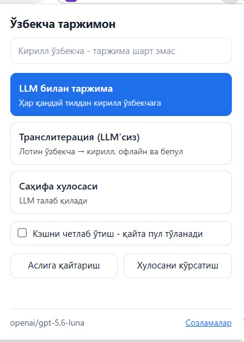
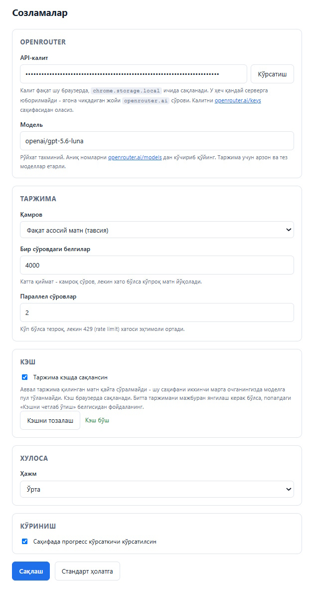

<p align="center">
  
</p>

<h1 align="center">Ўзбекча таржимон (Кирилл)</h1>

<p align="center">
  Веб-саҳифанинг асосий матнини <b>кирилл ўзбекчага</b> ўгирувчи Chrome кенгайтмаси.<br>
  Лотин ўзбекча учун офлайн транслитерация, қолган тиллар учун OpenRouter.
</p>

<p align="center">
  <a href="https://github.com/nurmuhammad/cyrillic-uzbek-extention/releases/latest">
    
  </a>
  <a href="LICENSE">
    
  </a>
  
</p>

<p align="center">
  <sub><i>Chrome extension that translates web page content into Uzbek (Cyrillic).<br>
  Offline transliteration for Latin Uzbek, OpenRouter LLM for everything else.</i></sub>
</p>

<p align="center">
  
</p>

Таржима саҳифанинг ўзида, жойида алмаштирилади. Асл матн хотирада сақланиб
қолади - битта тугма билан қайтариб оласиз.

---

## Нима қила олади

| Тугма | Нима қилади | Интернет ва пул |
|---|---|---|
| **LLM билан таржима** | Ҳар қандай тилдаги матнни кирилл ўзбекчага ўгиради | OpenRouter сўрови кетади |
| **Транслитерация (LLM'сиз)** | Лотин ўзбекчани кириллга ўгиради: `salom` → `салом` | Тармоққа чиқмайди, **бепул** |
| **Саҳифа хулосаси** | Асосий нуқталарни кирилл ўзбекчада чиқаради | OpenRouter сўрови кетади |

Қайси тугмани босишни **сиз ҳал қиласиз**. Кенгайтма фақат маслаҳат беради:
ойна тепасида «Лотин ўзбекча - LLM'сиз ўгириш мумкин» каби ёзув чиқади ва
тавсия этилган тугма кўк рангда ажратилади.

### Ойнани очмасдан ҳам ишлайди

| Усул | Нима қилади |
|---|---|
| Ўнг тугма → меню | Белгиланган матн ёки бутун саҳифа учун ўгириш ва қайтариш |
| `Alt+Shift+U` | LLM билан таржима |
| `Alt+Shift+L` | Транслитерация |
| `Alt+Shift+O` | Асл матнга қайтариш |

Қисқартма босилганда саҳифада матн белгиланган бўлса, фақат ўша қисм
ўгирилади. Қисқартмаларни `chrome://extensions/shortcuts` дан ўзгартирасиз.

---

## Ўрнатиш

Кенгайтма ҳали Chrome Web Store'да эмас, шунинг учун қўлда ўрнатилади.
Бор-йўғи бир дақиқалик иш:

**1.** Repo'ни юклаб олинг:

```bash
git clone https://github.com/nurmuhammad/cyrillic-uzbek-extention.git
```

ёки GitHub'даги яшил **Code** тугмаси → **Download ZIP** → архивни очинг.

**2.** Chrome'да `chrome://extensions` саҳифасини очинг.

**3.** Ўнг юқорида **Developer mode** ни ёқинг.

**4.** **Load unpacked** тугмасини босиб, юклаб олган жилдни танланг.

Тайёр - тулбарда кўк-яшил иконка пайдо бўлади.

> Windows'да ишлаётган бўлсангиз, `powershell -File tools/build.ps1` буйруғи
> кераксиз файлларсиз тоза нусхани `ready/` жилдига йиғади. Ўшани танласангиз
> ҳам бўлади, лекин шарт эмас.

---

## Созлаш

Иконкага босинг → пастдаги **Созламалар** ҳаволаси.

<p align="center">
  
</p>

### API-калит

Транслитерация калитсиз ҳам ишлайверади. LLM тугмалари эса калит киритилмагунча
ўчиб туради.

1. [openrouter.ai/keys](https://openrouter.ai/keys) га киринг
2. **Create key** босиб, калитни нусхалаб олинг (`sk-or-v1-...` билан бошланади)
3. Созламалардаги **API-калит** майдонига қўйинг → **Сақлаш**

OpenRouter'да ҳисобингизга озгина маблағ солиб қўйиш керак. Арзон моделлар билан
бир саҳифа таржимаси бир неча тийинга тушади.

### Модель

Стандарт қиймат - `google/gemini-2.5-flash`. Хоҳлаган моделни ёзишингиз мумкин,
аниқ номларни [openrouter.ai/models](https://openrouter.ai/models) дан кўчиринг.
Таржима учун арзон ва тез моделлар етарли, энг кучлисини танлашнинг ҳожати йўқ.

### Қолган созламалар

| Созлама | Нима учун |
|---|---|
| **Қамров** | Фақат асосий матн (тавсия) ёки бутун саҳифа |
| **Бир сўровдаги белгилар** | Катта қиймат - камроқ сўров, лекин хато бўлса кўпроқ матн йўқолади |
| **Параллел сўровлар** | Кўп бўлса тезроқ, лекин 429 (rate limit) хатоси эҳтимоли ортади |
| **Янги юкланган матн** | Чексиз лентада янги келган матнни ҳам ўзи таржима қилади |
| **Кэш** | Ёқилган ҳолда қолдиринг - пулни шу тежайди |
| **Хулоса ҳажми** | Қисқа / Ўрта / Батафсил |

Созламаларда яна **харажат ҳисоби** (бугун / шу ой / жами) ва **кэш рўйхати**
бор - кэшдаги ҳар бир ёзувни кўриб, кераксизини алоҳида ўчириш мумкин.

---

## Пулни қандай тежайди

Бу кенгайтма атайлаб LLM'га кам мурожаат қиладиган қилиб ёзилган:

**Кэш.** Бир марта таржима қилинган матн браузерда сақланади. Ўша саҳифани
иккинчи марта очсангиз, моделга сўров умуман кетмайди - статусда
«Тайёр - тўлиқ кэшдан» деб чиқади. Кэш созламалардан тозаланади. Битта
таржимани мажбуран янгилаш керак бўлса, ойнадаги **«Кэшни четлаб ўтиш»**
белгисини қўйинг.

**Белгиланган матн.** Саҳифада керакли жойни сичқонча билан белгилаб қўйсангиз,
ойнада **«Фақат белгиланган матн (N белги)»** қатори чиқади ва ўзи ёқилган
туради. Бутун саҳифа ўрнига фақат ўша абзац таржима қилинади.

**Транслитерация.** Сайт аллақачон лотин ўзбекчада бўлса, LLM умуман керак эмас -
офлайн ўгириш бир зумда ва бепул ишлайди.

**Бекор қилиш.** Таржима давомида **«Бекор қилиш»** тугмаси чиқади. У фақат
навбатни тўхтатиб қўймайди, балки учиб турган сўровларни ҳам узади - демак
кутилмаган харажат бўлмайди. Таржима қилиб улгурган матн жойида қолади.

---

## API-калитингиз қаерда сақланади

`chrome.storage.local` да, фақат шу браузерда. `sync` эмас - калит бошқа
қурилмаларингизга кўчирилмайди.

Калит **фақат** кенгайтманинг фон жараёнида ишлатилади ва ягона чиқадиган жойи -
`https://openrouter.ai` сўрови. Саҳифага юкланадиган скриптлар калитни умуман
кўрмайди, шунинг учун очиқ турган сайт уни ўқий олмайди.

Кенгайтма `openrouter.ai` дан бошқа ҳеч қандай доменга уланмайди - буни
`manifest.json` даги `host_permissions` дан текшириб кўришингиз мумкин.

---

## Билиб қўйиш керак

- Транслитерация лотин **ўзбекча** учун мўлжалланган. Инглизча саҳифада уни
  боссангиз, инглиз сўзлари ҳам кирилл ҳарфлар билан ёзилиб қолади - бундай
  саҳифада «LLM билан таржима» ни ишлатинг.
- Динамик юкланган матн (чексиз лента, «яна юклаш») ҳам автоматик таржима
  қилинади, лекин битта саҳифада кўпи билан 20 марта - назоратсиз харажатнинг
  олдини олиш учун. Созламалардан ўчириб қўйиш мумкин.
- Узун саҳифада хулоса бўлакларга бўлиниб, кейин бирлаштирилади - бунда бир
  нечта сўров кетади.
- `<pre>`, `<code>`, форма майдонлари ва яширин элементлар атайлаб тегилмайди.
- **iframe ичидаги матн** ҳам таржима қилинади (масалан `t.me` постлари).
  Агар iframe **бошқа доменда** бўлса, Chrome қўшимча рухсат сўрайди -
  ойнада «Бошқа доменли iframe'лар учун рухсат бериш» тугмаси чиқади.
- Кенгайтма `chrome://` каби ички саҳифаларда ишламайди - бу Chrome'нинг
  чекловидан.

---

## Тарқатиш

Кенгайтмада build қадами йўқ, лекин тарқатишда `screenshots/`, `tools/` ва `.md`
файллар кераксиз. Тоза нусхани `ready/` жилдига йиғадиган скрипт бор:

```bash
powershell -File tools/build.ps1
```

Chrome Web Store учун ZIP:

```bash
powershell -File tools/build.ps1 -Zip
```

`ready/` ҳар сафар қайта яратилади - унга қўлда ўзгартириш киритманг,
ўзгаришлар асосий жилдда бўлиши керак.

---

## Иконка

Ишлатилаётган дизайн - `icons/icon.svg`: байроқ йўлаклари ва
устида кирилл **Ў**. Ранглар: юқори `#038FD8`, паст `#0DA74C`, қизил `#CE1126`,
ҳарф ва рамка `#12233A`.

`icons/*.png` файллари қўлда таҳрирланмайди, генератордан чиқади:

```bash
powershell -File tools/build-icons.ps1
```

Ҳарф шрифтдан эмас, чизиқлардан ясалади (ҳар машинада бир хил чиқиши учун) ва
16px учун алоҳида содалаштирилади: қизил ингичка йўлаклар тушириб қолдирилади,
ҳарф қалинроқ чизилади. 

---

## Жилд тузилиши

```
manifest.json            Manifest V3
background.js            service worker - барча тармоқ сўровлари ва кэш
src/shared/              созламалар, промптлар, OpenRouter клиенти
src/content/             саҳифада ишлайдиган скриптлар
  translit.js              лотин -> кирилл транслитерация
  detect.js                тил тахмини
  extract.js               асосий матнни ажратиш
  content.js               оркестратор, оверлей, аслига қайтариш
src/popup/               тугмалар ойнаси
src/options/             созламалар саҳифаси
icons/                   иконкалар ва вариантлар
tools/                   build скриптлари
screenshots/             README учун расмлар
```

Техник тафсилотлар ва архитектура қарорлари - [CLAUDE.md](CLAUDE.md) да.

---

## Лицензия

[MIT](LICENSE) - хоҳлаган одам ишлатиши, ўзгартириши ва тарқатиши мумкин,
муаллифлик ёзувини сақлаган ҳолда.
